# Frontend Specification - Information Architecture

[← Back to Introduction](./01-introduction.md) | [Next: User Flows →](./03-user-flows.md)

---

## Site Map / Screen Inventory

The application is designed with a flat hierarchy optimized for speed - maximum 3 clicks to any document.

```mermaid
graph TD
    A[Dashboard/Home] --> B[Pillar 1: Labour Standards]
    A --> C[Pillar 2: Health & Safety]
    A --> D[Pillar 3: Business Ethics]
    A --> E[Pillar 4: Environment]
    A --> F[KPIs Dashboard]
    A --> G[CAPA Tracker]
    A --> H[Search Results]
    
    B --> B1[Policies Tab]
    B --> B2[Procedures Tab]
    B --> B3[Forms Tab]
    B --> B4[Evidence Tab]
    
    C --> C1[Policies Tab]
    C --> C2[Procedures Tab]
    C --> C3[Forms Tab]
    C --> C4[Evidence Tab]
    
    D --> D1[Policies Tab]
    D --> D2[Procedures Tab]
    D --> D3[Forms Tab]
    D --> D4[Evidence Tab]
    
    E --> E1[Policies Tab]
    E --> E2[Procedures Tab]
    E --> E3[Forms Tab]
    E --> E4[Evidence Tab]
    
    B1 --> DOC1[Document Viewer Modal]
    B2 --> DOC1
    B3 --> DOC1
    B4 --> DOC1
    C1 --> DOC1
    C2 --> DOC1
    C3 --> DOC1
    C4 --> DOC1
    D1 --> DOC1
    D2 --> DOC1
    D3 --> DOC1
    D4 --> DOC1
    E1 --> DOC1
    E2 --> DOC1
    E3 --> DOC1
    E4 --> DOC1
    
    H --> DOC1
    
    A --> UPLOAD[Upload Modal]
    B --> UPLOAD
    C --> UPLOAD
    D --> UPLOAD
    E --> UPLOAD
    F --> UPLOAD
    G --> UPLOAD
    
    G --> G1[CAPA List View]
    G1 --> G2[CAPA Details Panel]
    G2 --> G3[CAPA Form Modal]
```

---

## Navigation Structure

### Primary Navigation

**Persistent Top AppBar:**
- **Left:** Logo/Platform name
- **Center:** Global search bar (always accessible)
- **Right:** Upload button

**Dashboard Cards:**
- Main entry points to pillars/sections
- 6 large navigation cards (2 rows × 3 columns)
- Each card shows: Icon, Title, Document count

**No Traditional Menu:**
- Dashboard serves as navigation hub
- All sections accessible from dashboard cards
- Reduces cognitive load, speeds navigation

---

### Secondary Navigation

**Breadcrumbs:**
- Visible on all non-dashboard pages
- Format: `Home > Section Name > Subsection (if applicable)`
- Clickable at each level for quick navigation back
- Current page in bold/different color
- Critical for maintaining orientation during rapid document switching

**Tab Navigation:**
- Within pillar views: 4 category tabs (Policies, Procedures, Forms, Evidence)
- Horizontal tabs, all visible simultaneously
- Active tab has bottom border accent

**Back to Dashboard:**
- Button visible on all screens
- Quick return to navigation hub
- Alternative to breadcrumb navigation

---

### Breadcrumb Strategy

**Purpose:**
- Maintain user orientation during rapid document access
- Provide quick navigation to parent sections
- Show current location in hierarchy

**Format:**
- Always starts with "Home"
- Maximum 3 levels: `Home > Pillar > Category`
- Current page (last item) not clickable, styled differently

**Behavior:**
- Each segment clickable (except current page)
- Hover state on clickable segments
- Mobile: Simplifies to "< Back" button

**Examples:**
- Dashboard: No breadcrumb (user is at home)
- Pillar view: `Home > Pillar 2: Health & Safety`
- Category view: `Home > Pillar 2: Health & Safety > Policies`
- Search results: `Home > Search Results`
- CAPA tracker: `Home > CAPA Tracker`

---

## Navigation Patterns

### Card-Based Dashboard Navigation

**Pattern:** Large clickable cards as primary navigation
**Why:** Visual, intuitive for non-technical users, shows document counts at-a-glance

**Card Elements:**
- Large icon (48px, color-coded by section)
- Section title (h5 typography)
- Document count badge (dynamic, updates without reload)
- Hover effect (elevation increase, slight lift)

**Layout:**
- Desktop (≥1280px): 3 columns × 2 rows
- Tablet (960-1279px): 2 columns × 3 rows
- Mobile (<960px): 1 column × 6 rows

---

### Tab Navigation in Pillar Views

**Pattern:** Horizontal tabs for category selection
**Why:** All categories visible, familiar pattern, no hidden options

**Tab Behavior:**
- Click tab → Load documents for that category
- Active tab: Bottom border (3px, accent green)
- Loading state: Skeleton rows while fetching
- Empty state: "No documents uploaded yet" message

**Tab Order:**
1. Policies
2. Procedures
3. Forms
4. Evidence

---

### Modal Overlays for Documents

**Pattern:** Documents open in modal overlay, not new page
**Why:** Maintains context, faster back navigation, no loss of scroll position

**Modal Features:**
- Full-screen (90vw × 90vh)
- Semi-transparent backdrop (click to close)
- ESC key closes modal
- Close button (X) always visible (top-right)
- Returns to exact previous location when closed

---

### Global Search as Secondary Navigation

**Pattern:** Persistent search bar in AppBar
**Why:** Fast access when auditor requests specific document

**Search Features:**
- Type-ahead suggestions (shows as user types)
- Minimum 2 characters to trigger
- Enter key navigates to results page
- Results grouped by pillar
- Click result → Opens document in modal

---

## Design Rationale

**Flat Hierarchy:**
- Trade-off: Fewer categories vs. precise organization
- Chosen: Flat (max 3 clicks) - Speed is critical for audit day
- Alternative rejected: Deep categorization (too many clicks)

**Card-Based Dashboard:**
- Trade-off: Visual cards vs. traditional menu
- Chosen: Cards - More intuitive for non-technical users, shows counts
- Alternative rejected: Sidebar menu (less visual, hidden counts)

**Modal Overlays:**
- Trade-off: Modal vs. full-page view
- Chosen: Modal - Maintains context, faster back navigation
- Alternative rejected: Full-page (loses context, slower navigation)
- Concern: Some users may find modals claustrophobic (mitigated by large modal size)

**Omnipresent Upload Button:**
- Trade-off: Always visible vs. contextual placement
- Chosen: Always visible - Encourages year-round maintenance
- Supports long-term use beyond initial audit

---

## Information Scent

**Strong Scent (Easy to Find):**
- Pillar documents: Dashboard card → Pillar → Category tab → Document list
- Search: Search bar always visible → Type → Results → Document
- CAPA: Dashboard card → CAPA Tracker → List

**Potential Weak Scent:**
- KPIs: Not a "pillar" but equal hierarchy (acceptable - clearly labeled)
- CAPA evidence: Stored in CAPA category, not in pillar folders (document cross-referencing)

---

**[← Back to Introduction](./01-introduction.md) | [Next: User Flows →](./03-user-flows.md)**
