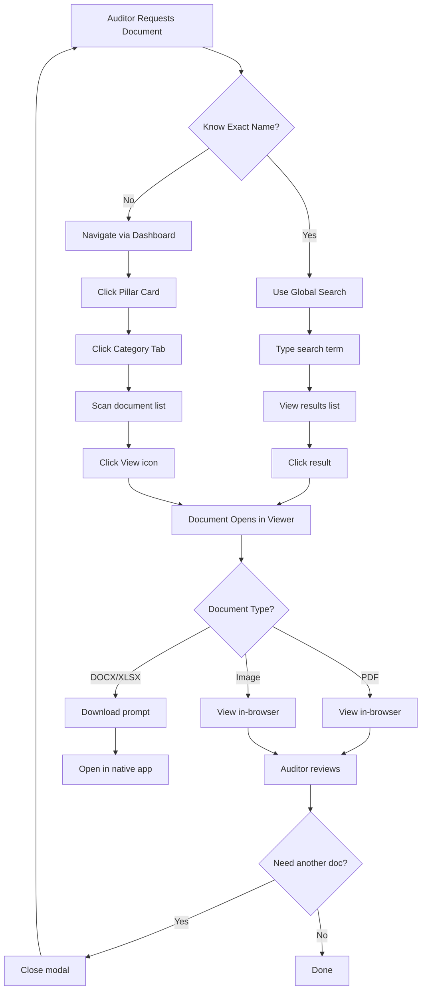
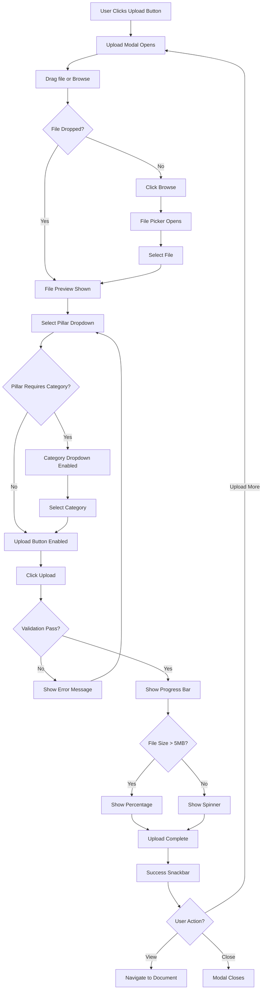
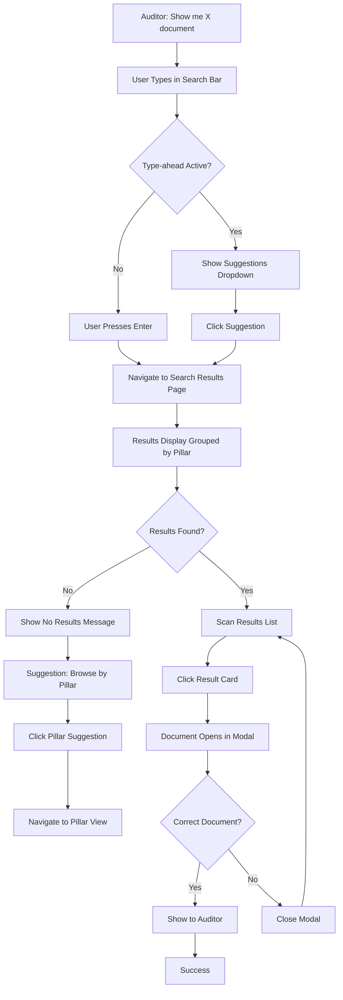

# Frontend Specification - User Flows

[← Back to Information Architecture](./02-information-architecture.md) | [Next: Screen Layouts →](./04-screen-layouts.md)

---

## Critical Audit Scenarios

The following flows are optimized for speed and clarity during the audit. Each flow must complete smoothly to ensure a successful audit presentation.

---

## Flow 1: Specific Document Request (Core Audit Scenario)

**User Goal:** Retrieve a specific document when auditor requests it by name or type

**Entry Points:**
- Global search bar (if auditor names specific document)
- Dashboard → Pillar card (if auditor requests by category)

**Success Criteria:** Document displayed to auditor within 10 seconds of request

### Flow Diagram



### Edge Cases & Error Handling

- **Search returns no results** → Show "No documents found" with suggestion to browse by pillar
- **PDF fails to load** → Show error with "Download instead" button
- **Large PDF slow to render** → Show loading spinner with progress indicator
- **Wrong document opened** → Easy close (X button, ESC key) returns to exact previous location
- **Network interruption** → Show error message, provide retry option

### Performance Requirements

- Search results: <3 seconds
- PDF render: <5 seconds
- Navigation (dashboard → document): <5 seconds total

---

## Flow 2: Document Upload (Maintenance Task)

**User Goal:** Add new compliance document to correct pillar/category

**Entry Points:**
- Upload button (top-right, available on all pages)
- Empty state "Upload" button in category tabs

**Success Criteria:** Document uploaded, categorized correctly, immediately accessible

### Flow Diagram



### Edge Cases & Error Handling

- **File too large (>50MB)** → Error: "File exceeds 50MB limit. Please compress or split."
- **Unsupported file type** → Error: "File type not supported. Accepted: PDF, DOCX, XLSX, JPG, PNG"
- **Upload fails (network/disk error)** → Error with "Retry" button
- **Duplicate filename** → Allow (system generates unique filename), show warning
- **User closes modal mid-upload** → Show confirmation: "Upload in progress. Cancel upload?"

### Context-Aware Behavior

- If opened from Pillar view → Pre-select that pillar
- Category dropdown only shows for Pillars 1-4 (not for KPIs/CAPA)
- Success snackbar includes "View" button → Opens document immediately

---

## Flow 3: CAPA Review with Auditor

**User Goal:** Demonstrate corrective action tracking and closure process

**Entry Points:** Dashboard → CAPA Tracker card

**Success Criteria:** Auditor sees complete CAPA lifecycle, understands process maturity

### Flow Diagram

```mermaid
graph TD
    A[Click CAPA Tracker Card] --> B[CAPA List View Loads]
    B --> C[Left: CAPA List | Right: Empty Details Panel]
    
    C --> D[User Filters by Status]
    D --> E[List Updates]
    E --> F[Click CAPA in List]
    
    F --> G[Details Panel Populates]
    G --> H{Auditor Requests Evidence?}
    H -->|No| I[Discuss CAPA Details]
    H -->|Yes| J[Navigate to CAPA Pillar]
    
    J --> K[CAPA Category View]
    K --> L[Open CAPA Folder/Documents]
    L --> M[Show Evidence]
    
    I --> N{Review Another CAPA?}
    M --> N
    N -->|Yes| F
    N -->|No| END[Return to Dashboard]
    
    B --> O[Optional: Add New CAPA]
    O --> P[Click Add CAPA Button]
    P --> Q[CAPA Form Modal]
    Q --> R[Fill Required Fields]
    R --> S[Save]
    S --> T[Success Notification]
    T --> U[List Refreshes with New CAPA]
```

### Edge Cases & Error Handling

- **Empty CAPA list** → Show message: "No CAPAs recorded. This is acceptable for new systems."
- **All CAPAs overdue** → Visual warning (red badges), but not blocking
- **CAPA evidence documents missing** → Note in details panel: "Evidence pending upload"
- **Duplicate CAPA ID** → Validation error: "CAPA ID already exists"

### Visual Design Notes

- Status color-coding critical: Red (Critical/Overdue), Orange (Major), Yellow (Minor), Green (Closed)
- Auditor should immediately see CAPA health at-a-glance
- Two-column layout keeps list visible while viewing details

---

## Flow 4: Global Search (Fast Retrieval)

**User Goal:** Find document quickly when auditor asks for something specific

**Entry Points:** Search bar in AppBar (persistent on all pages)

**Success Criteria:** Results displayed within 3 seconds, relevant results at top

### Flow Diagram



### Edge Cases & Error Handling

- **Search term too short (<2 chars)** → Disable search, show hint: "Type at least 2 characters"
- **Special characters in search** → Sanitize input, prevent SQL injection
- **Search API slow (>3 seconds)** → Show loading spinner, consider timeout message
- **Multiple exact matches** → Show all, sorted by pillar/category
- **Partial matches** → Highlight matching text in results

### Search Behavior

- **Forgiving:** Case-insensitive, ignore special characters
- **Fast:** Debounced input (300ms), type-ahead suggestions
- **Clear:** Results show filename, pillar/category path, file type icon, upload date
- **Grouped:** Results grouped by pillar for easier scanning

---

## Common Interaction Patterns

### Modal Interaction Pattern

**Used For:** Document viewer, upload modal, CAPA form

**Behavior:**
- Opens with fade + slight scale animation (300ms)
- Backdrop semi-transparent, click to close
- ESC key always closes modal
- Focus trapped within modal (Tab cycles within)
- Close returns focus to trigger element
- Maintains scroll position of underlying page

### List Selection Pattern

**Used For:** Document lists, CAPA lists

**Behavior:**
- Hover: Light gray background
- Click row: Opens detail view or modal
- Action buttons (View, Delete) in row
- Keyboard: Arrow keys navigate, Enter selects

### Form Validation Pattern

**Used For:** Upload form, CAPA form

**Behavior:**
- Inline validation (as user types for some fields)
- Submit validation (show all errors at once)
- Error messages below field
- Red border + error icon + descriptive text
- Success: Green snackbar notification
- No page reload on submit

---

## Performance Targets

| Flow | Target Time | Critical Path |
|------|-------------|---------------|
| Document retrieval (navigation) | 5-10 seconds | Dashboard → Pillar → Category → View |
| Document retrieval (search) | 5-8 seconds | Search → Results → View |
| Upload | Variable | Modal → Select → Upload → Confirm |
| CAPA review | 10-15 seconds | Dashboard → CAPA → Select → View details |

---

**[← Back to Information Architecture](./02-information-architecture.md) | [Next: Screen Layouts →](./04-screen-layouts.md)**
